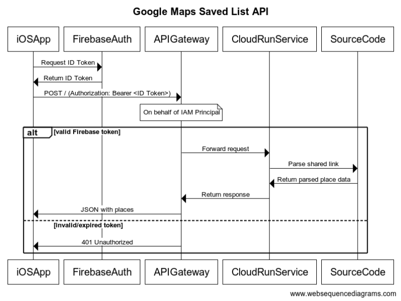

# google-maps-list-parser
Expands a short Google Maps URL (e.g., https://maps.app.goo.gl/...) to its final destination and returns the expanded URL and extracts the information of saved places.

This is designed to be deployed as Google Cloud Run service, allowing your applications to interact with it via API requests.

## API Endpoint
**Method:** POST

**Path:** `/` (root)

### Request Body:
```json
{
    "shared_link": "https://maps.app.goo.gl/..."
}
```
### Response Body:
```json
{
    "source_url": "https://www.google.com/maps/place/...",
    "owner_display_name": "...",
    "public_saved_list_name": "...",
    "places": [
        {
            "name": "...",
            "address": "...",
            "short_address": "...",
            "latitude": 0.0,
            "longitude": 0.0,
            "place_id": "...",
            "addedBy": {
                "name": "..."
            }
        }
        // More places...
    ]
}
```

## Disclaimer
This service is based on the Google Maps API response format as of 24/06/2025. Since Google may update its internal JSON structure at any time, this parser is not guaranteed to remain compatible with future changes.

## Potential Extended Application

Users can leverage the information in the response body to launch Google Maps for place searches, directions, and navigation based on the extracted public saved list. For additional inspiration, feel free to consult the [Google Maps URL documentation](https://developers.google.com/maps/documentation/urls/get-started).

## Setup and Deployment
- Node.js 22 recommended
- Hosted on Google Cloud Run Service
- Suggested Potential Architecture


## Dependencies
- axios — for following redirects and fetching HTML
- cheerio — for parsing and extracting metadata from HTML

## MIT License
```
MIT License

Copyright (c) 2025 Lawrence Shen

Permission is hereby granted, free of charge, to any person obtaining a copy
of this software and associated documentation files (the "Software"), to deal
in the Software without restriction, including without limitation the rights
to use, copy, modify, merge, publish, distribute, sublicense, and/or sell
copies of the Software, and to permit persons to whom the Software is
furnished to do so, subject to the following conditions:

The above copyright notice and this permission notice shall be included in all
copies or substantial portions of the Software.

THE SOFTWARE IS PROVIDED "AS IS", WITHOUT WARRANTY OF ANY KIND, EXPRESS OR
IMPLIED, INCLUDING BUT NOT LIMITED TO THE WARRANTIES OF MERCHANTABILITY,
FITNESS FOR A PARTICULAR PURPOSE AND NONINFRINGEMENT. IN NO EVENT SHALL THE
AUTHORS OR COPYRIGHT HOLDERS BE LIABLE FOR ANY CLAIM, DAMAGES OR OTHER
LIABILITY, WHETHER IN AN ACTION OF CONTRACT, TORT OR OTHERWISE, ARISING FROM,
OUT OF OR IN CONNECTION WITH THE SOFTWARE OR THE USE OR OTHER DEALINGS IN THE
SOFTWARE.

```

## Contact
Created by Lawrence Shen on 22/06/2025. Feel free to reach out for questions or contributions. 

## Revision History

| Version | Date       | Author           | Description                             |
|---------|------------|------------------|-----------------------------------------|
| 1.0.0   | 2025-06-22 | Lawrence Shen    | Initial release with URL expansion and place list extraction |